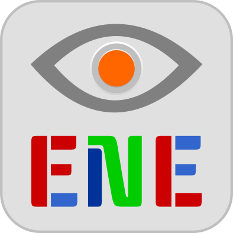

A comunidade ENE tem sido pensada para ser uma reunião de _makers_ e seus projetos com as seguintes mensagens:

- _"ENE is not ELA"_ ou **"a doença não vencerá"**

- `F` → `L` = _"force line"_ ou **"temos força"**

- `F` → `E` ~ _"fuck ELA"_ ou **"foda-se a ELA"**

- **Olhos** e **interruptores** são dois relevantes recursos para um portador de ELA (não excluindo os **sensores biológicos**)

- _"Do it yourself"_ ou **"fazer barato o que é essencial"** ou "conhecimento é poder"

---

All files are licensed under the [Creative Commons Attribution-NonCommercial-ShareAlike 4.0 International](https://creativecommons.org/licenses/by-nc-sa/4.0/) license.

Derivative of parts under [CC0](https://creativecommons.org/publicdomain/zero/1.0/deed.en) susch as [Eye](https://pixabay.com/en/eye-see-viewing-icon-1103592/) and [Switch](https://pixabay.com/en/switch-contact-button-on-off-1531504/), from [Pixabay](https://pixabay.com).

Font [Keania One](https://www.google.com/fonts/specimen/Keania+One) under [SIL Open Font License (OFL)](http://scripts.sil.org/cms/scripts/page.php?site_id=nrsi&id=OFL), by [Julia Petretta](mailto:julia.petretta@googlemail.com), from [Google Fonts](https://www.google.com/fonts/).

Typographic colors from Android palette for icons on [Inkscape](https://inkscape.org/en/download/).
